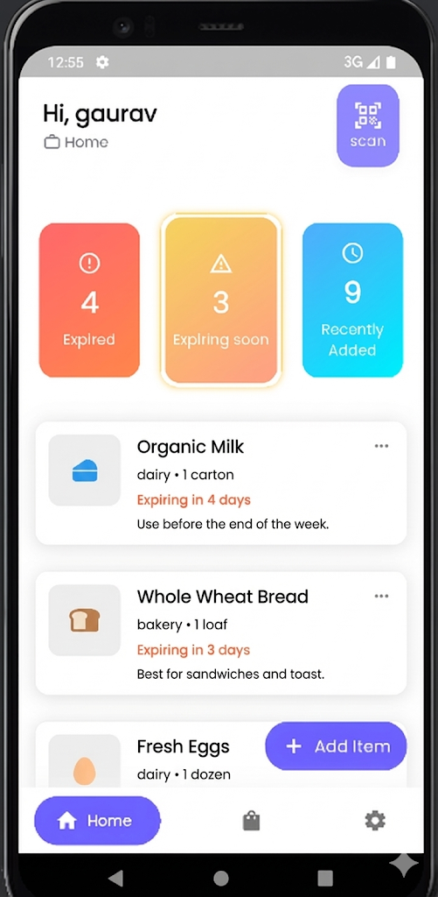

<div align="center">

# 🍎 Expiry Wise
**Smart Food Inventory & Expiry Tracker**

[](https://flutter.dev/)
[](https://dart.dev/)
[]()
[]()

<p>
  <b>Expiry Wise</b> is a smart mobile application designed to reduce food waste and manage household inventory efficiently. 
  It features an <b>Offline-First Architecture</b> using SQL and Firestore to ensure seamless performance even without internet.
  <br>
  Packed with <b>Barcode Scanning, Family Sync, and Smart Alerts</b>.
</p>

</div>

---

## 📱 App Gallery

A glimpse of the app's UI and key functionalities.

| Home & Notifications | Add Item (Scanner) | Item Details |
|:--------------------:|:------------------:|:------------:|
|  |  |  |
| **Dashboard & Alerts** | **Scan Barcode & Add** | **Edit & Manage Items** |

| Inventory (Filter View) | User Profile & Settings | Collaborative Space |
|:-----------------------:|:-----------------------:|:-------------------:|
|  |  |  |
| **Search & Sort Logic** | **Profile Management** | **Invite & Join Family** |

---

## ✨ Key Features

### 📡 Offline-First Architecture (New!)
* **Hybrid Database:** Uses **SQLite** for robust local storage and **Firebase Firestore** for cloud syncing.
* **Works Everywhere:** The app is fully functional offline. Data syncs automatically when the internet is restored.

### 📸 Barcode Scanner
* **Quick Entry:** Scan product barcodes to auto-fill details instantly. No manual typing required.

### 🛒 Smart Inventory Tracking
* **Visual Indicators:** Color-coded alerts—**Red** (Expired), **Orange** (Expiring Soon), **Green** (Fresh).
* **Sort & Filter:** Advanced sorting logic to find items by Category (Dairy, Veggies) or Expiry Date.

### 🔔 Smart Notifications
* **Local & Push Alerts:** Get notified before an item expires to ensure timely usage.
* **Dashboard Summary:** Quick view of "Items Expiring Today" directly on the Home Screen.

### 🤝 Family Sync (Real-time)
* **Collaborative Spaces:** Invite family members to your space via a unique code.
* **Live Updates:** Changes made by one member reflect instantly across all devices.

### ⚡ Optimization & Performance
* **Memory Efficient:** Implemented `cacheWidth` for image optimization.
* **Leak Free:** Uses Riverpod's `autoDispose` to manage state and memory efficiently.

---

## 🛠️ Tech Stack

* **Framework:** [Flutter](https://flutter.dev/)
* **Language:** Dart
* **State Management:** Riverpod State management
* **Databases:** * **SQLite (sqflite):** For offline persistence and fast local access.
    * **Firebase Firestore:** For backend syncing and real-time updates.
* **Key Packages:** `mobile_scanner`, `icons_plus`, `cached_network_image`, `flutter_local_notifications`.

---

## 🚀 How to Run Locally

1.  **Clone the project**
    ```bash
    git clone [https://github.com/your-username/expiry-wise.git](https://github.com/your-username/expiry-wise.git)
    cd expiry-wise
    ```

2.  **Install dependencies**
    ```bash
    flutter pub get
    ```

3.  **Firebase Setup**
    * Add your `google-services.json` (Android).

4.  **Run the App**
    ```bash
    flutter run
    ```

---

## 🔮 Future Improvements

* [ ] AI-based Recipe suggestions.
* [ ] Expense Analytics Chart.
* [ ] Dark Mode support.

---

## 👨‍💻 Author

**Gaurav**
* Flutter Developer | Performance Enthusiast
* Building apps that solve real-world problems.

---