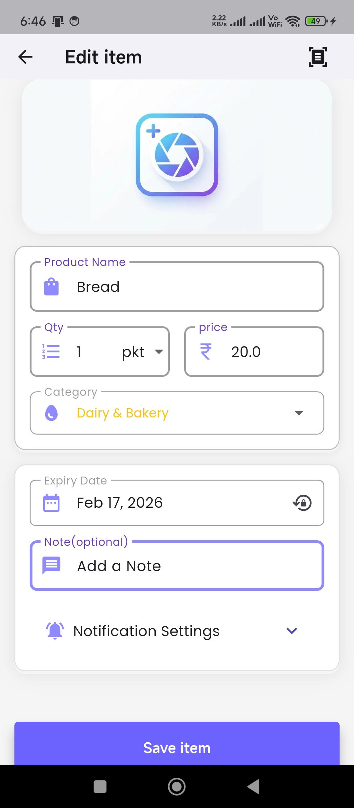
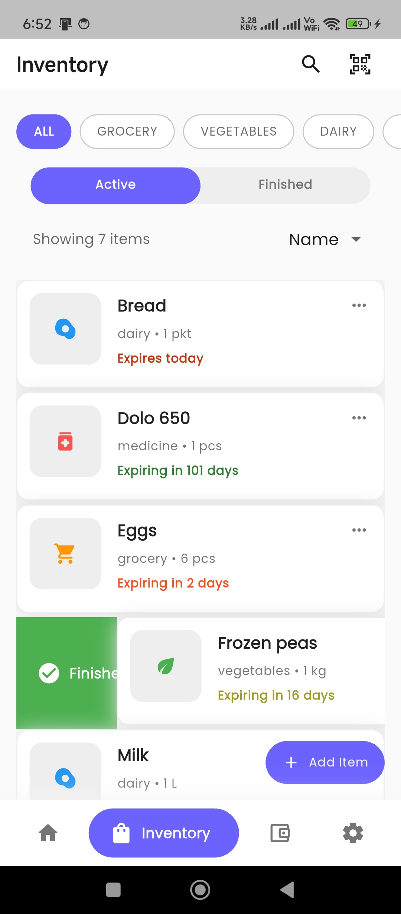
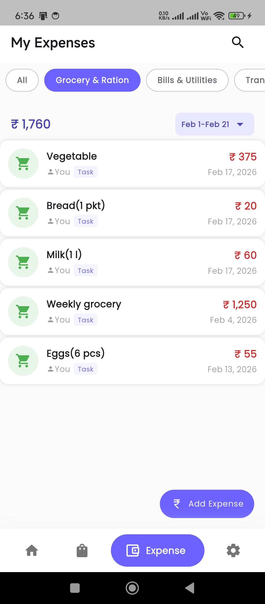
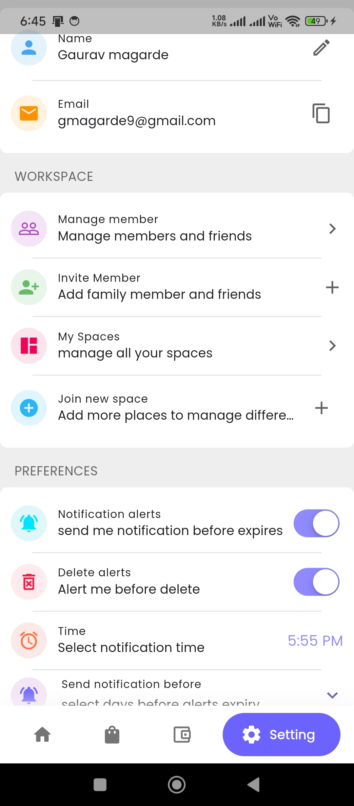

<div align="center">

# 🍎 ExpiryWise
**Smart Inventory & Expiry Tracker (Offline-First)**

[](https://flutter.dev/)
[]()
[]()
[]()

<p align="center">
  <b>ExpiryWise</b> helps reduce food waste by tracking inventory expiry dates. 
  Built with a robust <b>Offline-First Architecture</b>, it saves data locally using SQLite and syncs with Firebase in the background using WorkManager, ensuring the app works perfectly even without an internet connection.
</p>

</div>

---

## 📱 App Overview

A visual tour of ExpiryWise features.

|              **1. Smart Dashboard**               |               **2. AI & Scan Entry**               |              **3. Inventory Tracker**               |
|:-------------------------------------------------:|:--------------------------------------------------:|:---------------------------------------------------:|
|  |  |  |
|           **Visual Analytics & Alerts**           |            **Voice Command & Barcode**             |               **Filter by Freshness**               |

|               **4. Expense Manager**               |                 **5. Quick Lists**                  |                **6. User Profile**                |
|:--------------------------------------------------:|:---------------------------------------------------:|:-------------------------------------------------:|
|  |  |  |
|              **Track Food Spending**               |             **Fast Access Essentials**              |            **Sync Status & Settings**             |
---

## ✨ Key Features

✅ **Offline-First Design**
The app relies on **SQLite** for all immediate actions. You can add, edit, or delete items while offline. Data is synced to the cloud (Firebase) automatically when the internet restores.

✅ **Background Synchronization**
Implemented a custom sync engine using **WorkManager**. It runs periodically in the background to push local changes to the server and keep data consistent without opening the app.

✅ **AI-Powered Entry (Gemini)**
Integrated **Google Gemini AI** for smart entry. Instead of typing manually, you can use voice commands (e.g., *"Milk, Bread, and Eggs"*) to auto-fill item details.

✅ **Smart Notifications**
Local notification system that alerts you before items expire (Today, Tomorrow, or Soon) so food doesn't go to waste.

✅ **Family & Space Management**
Create shared "Spaces" and invite family members. Inventory is synced across all devices so everyone stays updated.

✅ **Barcode Scanner**
Built-in scanner to quickly add packaged products.

---

## 🛠️ Tech Stack

* **Framework:** Flutter (Dart)
* **State Management:** Riverpod
* **Architecture:** Clean Architecture + MVVM
* **Local Database:** `sqflite` (SQLite)
* **Backend:** Firebase Firestore (Cloud Storage) & Auth
* **Background Tasks:** `workmanager` (Android/iOS background fetch)
* **AI Integration:** Google Generative AI (Gemini)
* **Notifications:** `flutter_local_notifications`

---

## 🚀 How to Run

1.  **Clone the project**
    ```bash
    git clone [https://github.com/your-username/expiry-wise.git](https://github.com/your-username/expiry-wise.git)
    cd expiry-wise
    ```

2.  **Install dependencies**
    ```bash
    flutter pub get
    ```

3.  **Firebase Setup**
    * Place your `google-services.json` in `android/app/`.

4.  **Run the App**
    ```bash
    flutter run
    ```

---

## 👨‍💻 Developer

**Gaurav Magarde**
* Focused on building scalable, offline-capable mobile applications.

---